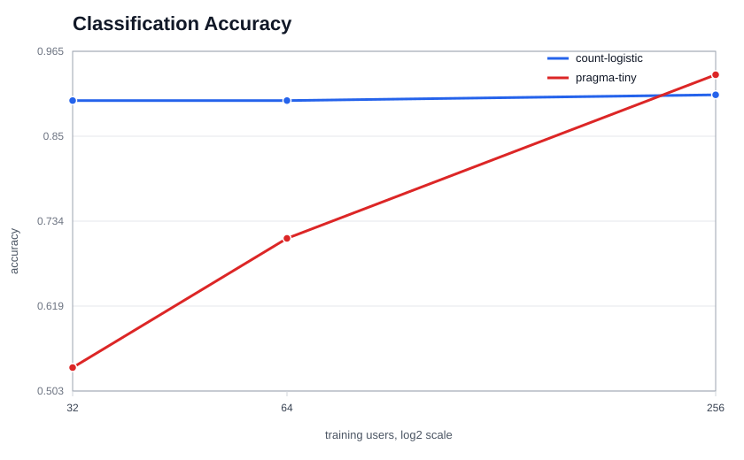
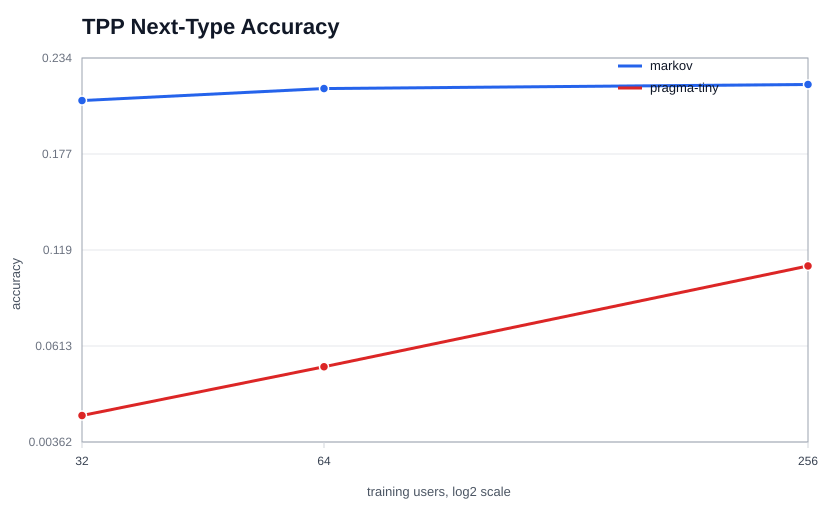
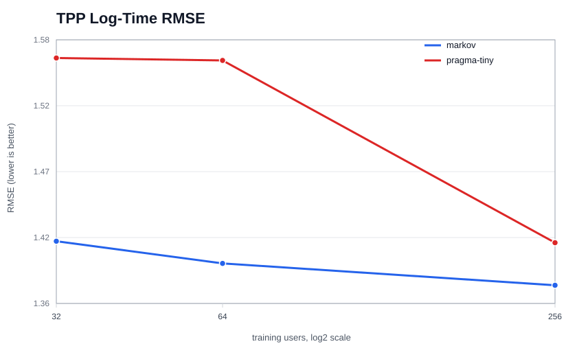

# EventFM

EventFM is a research scaffold for foundation models over user event histories. It implements a PRAGMA-style baseline inspired by the paper at <https://arxiv.org/html/2604.08649v1>: represent each user as a sequence of events, represent each event as key/value feature tokens plus time, encode events independently, encode the user history, and export embeddings for downstream tasks.

The first milestone is intentionally narrow and runnable:

- 50 synthetic event types plus irregular timestamps.
- Masked event-value pretraining.
- A binary sequence classification task.
- A simple TPP-style task: predict next event type and log inter-arrival time from a prefix.
- Classic baselines for comparison.
- Hydra configs, Hugging Face `transformers` models and `Trainer`, and W&B logging.

## Repository Layout

```text
configs/                 Hydra config groups
eventfm/data/            JSONL schema, tokenizer, collators, synthetic data
eventfm/models/          HF-compatible PRAGMA-style model classes
eventfm/training/        metrics and training helpers
eventfm/baselines/       non-neural baselines
scripts/                 runnable entrypoints
tests/                   smoke tests
```

## Install

```bash
python -m venv .venv
source .venv/bin/activate
pip install -e ".[dev]"
```

## Data Format

Each line is one user/entity:

```json
{
  "user_id": "user_000001",
  "events": [
    {"event_type": "type_3", "timestamp": 1704067200.0, "features": {}},
    {"event_type": "type_4", "timestamp": 1704088800.0, "features": {}}
  ],
  "label": 1,
  "profile": {}
}
```

For bank or open-source data, keep `event_type` and `timestamp` stable, then add extra per-event fields under `features`. The tokenizer already maps them as `key:<field>` and `value:<field>:<value>`. For higher time resolution, keep raw timestamps in seconds or sub-second floats; only the tokenizer/model time features need to be extended.

## Quickstart

Generate synthetic data:

```bash
python scripts/make_synthetic.py
```

Run classic baselines:

```bash
python scripts/run_baselines.py
```

Run a CPU-friendly scaling-law sweep across downstream sample sizes:

```bash
python scripts/run_scaling_laws.py
```

With the local `KBC` conda environment used for verification:

```bash
conda run -n KBC python scripts/run_scaling_laws.py
```

This writes full run artifacts under `outputs/scaling_laws` and publishes the GitHub-visible report files under `docs/scaling_laws`. The default uses `model=pragma_tiny`, six CPU-friendly epochs, and sample sizes `[32, 64, 256]`. For more meaningful curves, increase the budget:

```bash
python scripts/run_scaling_laws.py scaling.sample_sizes='[128,256,512,1024]' scaling.neural_max_steps=100
```

## Scaling Results

These results were generated with:

```bash
conda run -n KBC python scripts/run_scaling_laws.py
```

They are CPU-friendly curves using `model=pragma_tiny`, sample sizes `[32, 64, 256]`, balanced labeled prefixes, and six neural training epochs per downstream task/sample size. The setup is designed to show the expected direction: more labeled users improves downstream quality.

### Classification

| samples | method | accuracy |
| --- | --- | --- |
| 32 | count-logistic | 0.8984 |
| 32 | pragma-tiny | 0.5352 |
| 64 | count-logistic | 0.8984 |
| 64 | pragma-tiny | 0.7109 |
| 256 | count-logistic | 0.9062 |
| 256 | pragma-tiny | 0.9336 |



### Temporal Point Process

| samples | method | next_type_accuracy | delta_log_rmse |
| --- | --- | --- | --- |
| 32 | markov | 0.2087 | 1.4148 |
| 32 | pragma-tiny | 0.0195 | 1.5613 |
| 64 | markov | 0.2160 | 1.3970 |
| 64 | pragma-tiny | 0.0488 | 1.5594 |
| 256 | markov | 0.2184 | 1.3795 |
| 256 | pragma-tiny | 0.1094 | 1.4136 |

For `delta_log_rmse`, lower is better.





Pretrain the PRAGMA baseline:

```bash
python scripts/train.py task=pretrain
```

Fine-tune a classifier from a pretrained checkpoint:

```bash
python scripts/train.py task=classification task.checkpoint_path=outputs/pretrain
```

Train the next-event/time head:

```bash
python scripts/train.py task=tpp task.checkpoint_path=outputs/pretrain
```

Extract user embeddings:

```bash
python scripts/extract_embeddings.py extract.checkpoint_path=outputs/pretrain extract.split=test
```

Enable W&B:

```bash
python scripts/train.py task=pretrain logging.wandb.enabled=true logging.wandb.project=eventfm
```

## Model

`PragmaBackbone` has three levels:

1. Shared token embeddings for semantic keys and feature values.
2. An event encoder over the feature tokens of each event, with an `[EVT]` summary token.
3. A history encoder over event summaries plus a `[USR]` user token, calendar features, and continuous time-age encodings.

Heads:

- `PragmaForMaskedEventModeling`: reconstruct masked event feature values.
- `PragmaForSequenceClassification`: downstream label prediction from the user embedding.
- `PragmaForNextEventPrediction`: next event type classification plus log-delta regression.

The implementation uses Hugging Face `PreTrainedModel`, `BertEncoder` blocks, `TrainingArguments`, and `Trainer`, so checkpoints can be saved/loaded using normal `transformers` workflows.

## Configs

Hydra config groups:

- `data=synthetic`: split paths, event count, event type count, sequence length.
- `model=pragma_tiny`: small default for local iteration.
- `model=pragma_s_paperish`: closer to the paper's small baseline scale.
- `task=pretrain`, `task=classification`, `task=tpp`.

Common overrides:

```bash
python scripts/train.py model=pragma_s_paperish training.per_device_train_batch_size=16
python scripts/train.py data.num_users=10000 data.max_events_per_sequence=256
python scripts/train.py training.fp16=true logging.wandb.enabled=true
```

## Research Notes

This repo is set up so PRAGMA is the baseline rather than the whole project. New competitors should implement the same tensor contract as `PragmaBackbone` or expose a compatible `PreTrainedModel` head. That keeps datasets, masking, metrics, W&B logging, and downstream tasks shared across experiments.

Useful next extensions:

- Add feature specs for numeric buckets, text tokens, and bank-specific categorical fields.
- Add causal history masking for full-sequence TPP objectives.
- Add scalable sharded datasets for large internal data.
- Add richer timestamp encodings, such as relative-time RoPE or learned multi-resolution time buckets.
- Add self-supervised objectives beyond masked value modeling.

## Tests

```bash
pytest
python -m py_compile $(find eventfm scripts -name "*.py")
```
