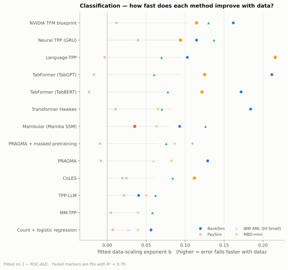
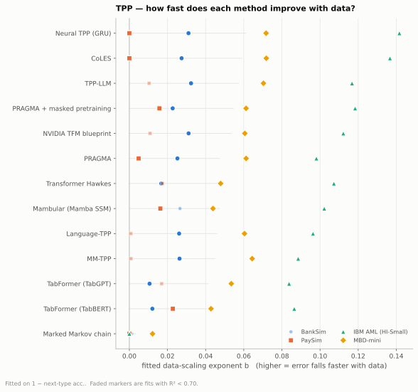
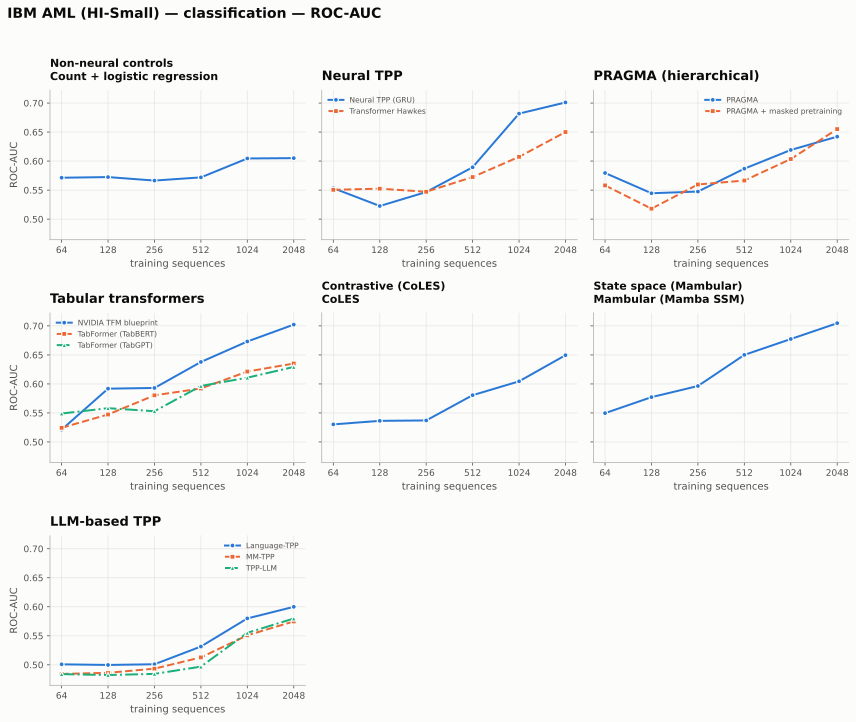
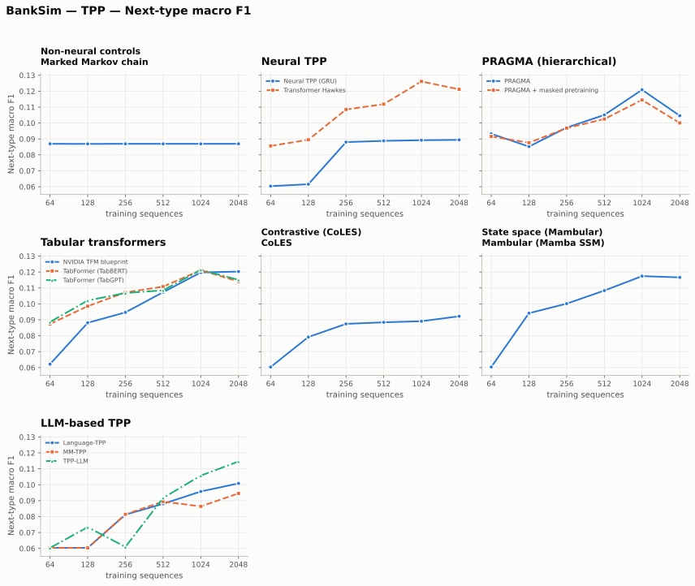

# EventFM — benchmarking temporal-semantic foundation models for event streams

This repository turns the survey in `KBC__TPP.pdf` ("Toward a Temporal-Semantic
Foundation Model for Event Prediction") into a runnable comparison: **every
architecture the note discusses, evaluated on every open benchmark it names, on
both of the tasks it cares about.**

* **What** — the completed 14-method architecture screen, expanded to 62
  runnable method/ablation keys and named paper experiment suites.
* **Where** — four banking benchmarks, four chronological variants, three
  large-scale benchmarks (full MBD, a 575k-patient synthetic EHR, and Amazon
  Beauty 2014), five GEM/TPP-LLM reference datasets, and a synthetic smoke
  fixture.
* **How measured** — binary sequence **classification** (a forward-looking
  business label) and a marked **temporal point process** task (predict the next
  event type *and* the time until it happens).
* **Scaling** — every cell is run at six training-set sizes on the screening
  benchmarks, and in octaves up to the **whole training pool** on the three
  scale benchmarks (10-12 points, 64 to 93 305 sequences), so each method gets
  its own sample-scaling curve rather than one number.

Everything is built on the Hugging Face ecosystem: models subclass
`PreTrainedModel`, training goes through `Trainer`/`TrainingArguments`, the LM
entries use `AutoModel` + `peft` LoRA, Mamba comes from `transformers`, and the
datasets are pulled with `huggingface_hub`.

The reasoning behind the dataset construction, the label definitions and the
fairness controls is in **[docs/benchmark_design.md](docs/benchmark_design.md)** —
read that before trusting any number here. The paper-facing specification of
where this benchmark still falls short of a publishable result lives in
**[docs/research/](docs/research/)**.

This is an **architecture-screening benchmark**, not a foundation-model result:
several named methods are controlled approximations, and pretraining shares the
same corpus as downstream training. The original screen ran entirely on training
sets in the low thousands of sequences; the `scale-datasets` suite extends that
to 93 305 (Synthea), 34 023 (Amazon Beauty) and 30 665 (full MBD) labelled
sequences. That widens the measured scaling range from 5 octaves to 10, and is
what makes every fitted power law pass its R² gate — but it does not change the
approximation caveats, and it does not make Synthea real clinical data.

The exhaustive live inventory is in
**[docs/research/implementation_manifest.md](docs/research/implementation_manifest.md)**;
the commands and experiment map are in
**[docs/research/experiment_execution.md](docs/research/experiment_execution.md)**,
and the live capped run is tracked in
**[docs/research/campaign_status.md](docs/research/campaign_status.md)**.

---

## Results

Two campaigns, kept in separate directories so neither overwrites the other.

### Large-dataset scaling — **[docs/benchmark_scale/](docs/benchmark_scale/)**

The current programme: full MBD, Synthea EHR and Amazon Beauty 2014, over
**10-12 sample points spanning 64 to 93 305 training sequences**.

> **Interim: 3 013 of 3 360 cells, zero failures** (updated 2026-09-17).
> `scale-datasets-baselines` is complete (864/864). Outstanding: 152 CPU cells
> of `scale-datasets` (4 workers still running) and 195 GPU cells (lane
> cancelled, see [gpu_resume.md](docs/research/gpu_resume.md)). Provisional until the campaign closes — live status in
> [docs/research/campaign_status.md](docs/research/campaign_status.md).

Mean over three seeds at each dataset's largest sample point:

| Dataset | Task | Best | Score | Control | Gain |
| --- | --- | --- | ---: | ---: | ---: |
| MBD (full) | classification (AUC) | `pragma-mlm` | 0.731 | 0.696 | +0.035 |
| Synthea EHR | classification (AUC) | `supervised-gru` | 0.882 | 0.833 | +0.049 |
| Amazon Beauty | classification (AUC) | `autoregressive-transformer` ¹ | 0.708 | 0.589 | **+0.119** |
| MBD (full) | TPP (next-type acc.) | `pragma-mlm` | 0.586 | 0.489 | +0.097 |
| Synthea EHR | TPP (next-type acc.) | `autoencoder` | 0.439 | 0.319 | **+0.120** |
| Amazon Beauty | TPP (next-type acc.) | `transaction-mlm` | 0.492 | 0.463 | +0.028 |

¹ A statistical tie: `thp`, `pragma-mlm` and `autoencoder` are within 0.0004 AUC. The earlier `thp` lead was a one-seed mean. The control has two of three seeds at this point.

**The headline gain is reliability, not the scores.** Every fitted scaling law
passes the `R² >= 0.70` gate — on every dataset, for every method except the
Markov control. The screen below could not say that: PaySim failed the gate for
nearly every method, and several of its exponents came out negative. Ten to
twelve points across four orders of magnitude of `N` is what bought the
difference, and it is the main reason these datasets were added.

Three results carry over from the screen and now hold on three new datasets and
two new domains:

* **The Markov control does not scale at all** — `b` of 0.004, 0.001, 0.001, all
  three failing the R² gate. A first-order transition table converts no amount
  of extra data into accuracy, which is exactly what it should do. Every neural
  method has an order of magnitude more slope.
* **Classification scales about twice as fast as the TPP task**, `b ≈ 0.05-0.13`
  against `0.04-0.05`. More labelled entities helps a sequence-level label more
  than it helps next-mark prediction, where the mark distribution binds.
* **Ranking by slope and ranking by score still disagree.** `autoencoder` has
  the steepest classification exponent (0.126) and tops no cell; `supervised-gru`
  wins Synthea outright on a middling 0.094. Reading only the largest-`N` table
  would miss both.

### Legacy architecture screen — **[docs/benchmark/](docs/benchmark/)**

The original four-dataset, six-point run. Superseded by the above for anything
scaling-related, kept because it is the complete 14-method screen:

| File | What it holds |
| --- | --- |
| [`results.md`](docs/benchmark/results.md) | all methods per dataset and task, both tasks |
| [`results.csv`](docs/benchmark/results.csv) | every cell: metric × method × dataset × sample size |
| `figures/by_method/` | **one scaling curve per method**, its datasets overlaid (160 files for the legacy four-dataset run) |
| `figures/by_dataset/` | per dataset, small multiples faceted by architecture family (64 files) |

> **Coverage: complete.** All 624 cells ran, none failed — 480 non-LLM on a CPU
> array (~6 CPU-hours) and 144 LLM cells on RTX 3090s (~15 GPU-hours).

> **Legacy-result warning.** These 624 results predate the current paper-grade
> converter. Their prepared PaySim/IBM-AML/MBD evaluation pools were affected by
> global negative downsampling. They remain a reproducible architecture screen,
> but must not be presented as natural-prevalence headline results. Rebuild with
> `python scripts/prepare_data.py --force` and rerun a named research suite for
> publication-facing tables.

Figure filenames are deterministic:

```text
figures/by_method/<method>__<task>__<metric>.svg      # + .dark.svg
figures/by_dataset/<dataset>__<task>__<metric>.svg    # + .dark.svg
```

with `<metric>` one of `auc`, `average_precision`, `accuracy`, `macro_f1`
(classification) or `next_type_accuracy`, `next_type_macro_f1`,
`delta_log_rmse`, `delta_log_mae` (TPP). Each figure ships a light and a dark
variant.

#### What the legacy run says

**624 cells complete — 14 methods × 4 datasets × 2 tasks × 6 sample sizes, zero
failures.** Best method per cell at the largest sample point, against the
relevant non-neural control:

| Dataset | Task | Best | Score | Control | Best LLM entry |
| --- | --- | --- | ---: | ---: | --- |
| BankSim | classification (AUC) | `nvidia-tfm` | 0.801 | 0.757 | `tpp-llm` 0.652 |
| PaySim | classification (AUC) | `mambular` | 0.546 | 0.532 | `mm-tpp` 0.539 |
| IBM AML | classification (AUC) | `mambular` | 0.705 | 0.605 | `language-tpp` 0.600 |
| MBD-mini | classification (AUC) | `ntpp-gru` | 0.717 | 0.660 | `language-tpp` 0.699 |
| BankSim | TPP (next-type acc.) | `markov` | **0.850** | 0.850 | `tpp-llm` 0.844 |
| PaySim | TPP (next-type acc.) | `tabgpt` | 0.546 | 0.543 | `mm-tpp` 0.531 |
| IBM AML | TPP (next-type acc.) | `ntpp-gru` | 0.629 | 0.466 | `tpp-llm` 0.609 |
| MBD-mini | TPP (next-type acc.) | `language-tpp` | **0.538** | 0.462 | `language-tpp` 0.538 |

Mean rank over all eight (dataset × task) cells, 1 = best:

| Method | Family | Mean rank |
| --- | --- | ---: |
| `nvidia-tfm` | tabular transformer | 5.0 |
| `pragma-mlm` | hierarchical | 5.0 |
| `ntpp-gru` | neural TPP | 5.5 |
| `pragma` | hierarchical | 5.6 |
| `thp` | neural TPP | 6.0 |
| `mambular` | state space | 6.2 |
| `tabgpt` | tabular transformer | 6.9 |
| `coles` | contrastive | 7.2 |
| `tabbert` | tabular transformer | 7.9 |
| `language-tpp` | LLM | 8.0 |
| `tpp-llm` | LLM | 9.6 |
| `mm-tpp` | LLM | 10.2 |

(`markov` 7.2 and `count-logistic` 8.2 are ranked over their four cells each,
since each control covers only one task.)

Five things stand out, and three of them are cautionary:

1. **No architecture wins everywhere.** The best method differs across all eight
   cells, and the spread among the leading neural methods is smaller than their
   gap to the controls. Mean ranks from 5.0 to 6.2 cover six different families.
   At this scale the benchmark does not identify a preferred backbone.
2. **The LLM entries are the weakest group**, occupying three of the bottom four
   mean ranks despite costing ~15 GPU-hours against ~6 CPU-hours for everything
   else. Read this as a statement about *budget*, not about the papers: a frozen
   135M base with LoRA is far below the scale those methods were designed for.
3. **Among the LLM entries, time-in-the-prompt beats time-on-the-side.**
   `language-tpp` (byte-token intervals) outranks `tpp-llm` (continuous temporal
   embedding) 8.0 to 9.6, and takes the top spot outright on MBD-mini TPP. That
   is the tokenisation question in the project note getting a directional
   answer. MM-TPP's compression does not pay off here — histories are short
   enough that context length was never the binding constraint.
4. **On BankSim's TPP task nothing beats a first-order Markov chain** (0.850 ≈
   the majority-mark rate). The neural models do win on macro F1 and time error,
   which is why those are reported separately.
5. **PaySim barely discriminates** (best AUC 0.546, nearly flat in *n*). Four
   marks and ~11 events per sequence is not enough signal; it is included
   because the project note names it.

Where the models clearly earn their keep is IBM AML and MBD-mini on the TPP
task: **+0.16** and **+0.08** next-type accuracy over Markov, with curves still
rising at n=2048.

#### Scaling laws (legacy four-dataset run)

Each curve's error is fitted to **`E(N) = a · N^-b`**, where `N` is the number of
labelled training sequences. **`b` is the data-scaling exponent** — how fast the
error falls as data is added. This ranks methods by *data efficiency* rather
than by score at one sample size, which is the more relevant question for a
foundation model. Full table in
[`docs/benchmark/scaling_exponents.md`](docs/benchmark/scaling_exponents.md).

<picture>
  <source media="(prefers-color-scheme: dark)" srcset="docs/benchmark/figures/scaling_laws/exponents__classification.dark.svg">
  
</picture>

<picture>
  <source media="(prefers-color-scheme: dark)" srcset="docs/benchmark/figures/scaling_laws/exponents__tpp.dark.svg">
  
</picture>

Mean exponent over the fits that pass an `R² ≥ 0.70` gate (count in brackets;
higher = error falls faster with data):

| Classification (`1 − AUC`) | b | | TPP (`1 − next-type acc.`) | b |
| --- | ---: | --- | --- | ---: |
| `nvidia-tfm` | 0.136 [3] | | `tpp-llm` | 0.073 [3] |
| `tabgpt` | 0.132 [3] | | `nvidia-tfm` | 0.068 [3] |
| `language-tpp` | 0.129 [3] | | `ntpp-gru` | 0.061 [4] |
| `pragma` | 0.129 [1] | | `language-tpp` | 0.061 [3] |
| `thp` | 0.127 [2] | | `mm-tpp` | 0.060 [3] |
| `tabbert` | 0.124 [3] | | `coles` | 0.059 [4] |
| `ntpp-gru` | 0.115 [3] | | `thp` | 0.057 [3] |
| `coles` | 0.098 [2] | | `pragma-mlm` | 0.055 [4] |
| `mambular` | 0.085 [3] | | `mambular` | 0.054 [3] |
| `pragma-mlm` | 0.076 [1] | | `tabgpt` | 0.049 [3] |
| `mm-tpp` | 0.058 [1] | | `pragma` | 0.047 [4] |
| **`count-logistic`** | **0.056 [1]** | | `tabbert` | 0.041 [4] |
| `tpp-llm` | 0.051 [2] | | **`markov`** | **0.004 [3]** |

Reading these:

* **The Markov control is the flattest thing in the benchmark** — `b = 0.004`,
  essentially zero, and exactly `0.000` on two datasets. It does not improve
  with data at all, which is what a first-order transition table should do once
  it has seen enough transitions. That reframes its BankSim win: it is not
  *learning* better, the task is just easy to hit with a majority rule. Every
  neural method has an order of magnitude more slope.
* **Scaling rate and final score rank differently, and the LLM entries are the
  clearest case.** `tpp-llm` has the *steepest* TPP exponent (0.073) while
  sitting 12th of 13 on absolute score, and `language-tpp` is 3rd-fastest on
  classification despite a near-bottom AUC. They start badly and close fast —
  the profile of methods that are under-trained at this budget rather than
  unsuited to the problem. `mambular` is the mirror image: strong absolute
  scores, middling slope.
* **Classification scales about twice as fast as the TPP task** (`b ≈ 0.12–0.14`
  vs `0.05–0.07`). More labelled clients helps a sequence-level label much more
  than it helps next-mark prediction, where the mark distribution is the binding
  constraint.
* **PaySim fails the fit gate for nearly every method on classification**, and
  several of its exponents are *negative* — error rising with data. That is the
  signature of a task with no learnable signal, not of a bad model, and it
  corroborates the flat AUC curves above. It is why the table reports a
  reliable-only mean alongside the raw one.
* Exponents are fitted on six points, so read them as a **local slope over the
  measured range**, not an asymptotic claim. Bracketed counts below 3 (e.g.
  `pragma` at [1]) rest on a single dataset and should not carry weight.

#### Method scaling curves, at a glance (legacy)

<picture>
  <source media="(prefers-color-scheme: dark)" srcset="docs/benchmark/figures/by_dataset/ibm_aml__classification__auc.dark.svg">
  
</picture>

<picture>
  <source media="(prefers-color-scheme: dark)" srcset="docs/benchmark/figures/by_dataset/banksim__tpp__next_type_macro_f1.dark.svg">
  
</picture>

---

## The method zoo

> **Fidelity matters here.** In this historical 14-method table, `Implemented`
> marks the two non-neural controls and every named architecture is an
> `Approximation`. The expanded registry also contains controlled implemented
> baselines and ablation conditions. Each key declares its status and divergence,
> enforced by tests and surfaced in result artifacts. **A row named after a
> paper is not automatically a reproduction of that paper** — see
> [docs/research/method_catalog.md](docs/research/method_catalog.md).

| Key | Paper / system | Family | Fidelity |
| --- | --- | --- | --- |
| `count-logistic` | non-neural control | classic | Implemented |
| `markov` | non-neural control | classic | Implemented |
| `ntpp-gru` | Shchur et al., *Neural temporal point processes: a review* | neural TPP | Approximation |
| `thp` | Transformer-Hawkes-style attention intensity model | neural TPP | Approximation |
| `pragma` | Ostroukhov et al., *PRAGMA: Revolut foundation model* | hierarchical | Approximation |
| `pragma-mlm` | PRAGMA with its masked-value pretraining stage | hierarchical | Approximation |
| `tabbert` | Padhi et al., *Tabular transformers* (BERT variant) | tabular transformer | Approximation |
| `tabgpt` | Padhi et al., *Tabular transformers* (GPT variant) | tabular transformer | Approximation |
| `nvidia-tfm` | NVIDIA Transaction Foundation Model blueprint | tabular transformer | Approximation |
| `coles` | Babaev et al., *CoLES* (pytorch-lifestream recipe) | contrastive | Approximation |
| `mambular` | Thielmann et al., *Mambular* | state space | Approximation |
| `tpp-llm` | Liu & Quan, *TPP-LLM* | LLM | Approximation |
| `language-tpp` | Kong et al., *Byte-token enhanced LMs for TPP analysis* | LLM | Approximation |
| `mm-tpp` | Li et al., *Long-range modeling of multimodal event sequences* | LLM | Approximation |

All non-hierarchical models share one event embedding and one pair of task
heads, and differ **only** in the sequence mixer and the pretraining objective —
that is what makes the table a comparison of architectures rather than of
implementations. PRAGMA keeps its own hierarchical encoder, because the
hierarchy is the method.

The three LM entries share one frozen base LM with LoRA adapters and differ only
in how the history is serialised — textual marks with a continuous temporal
embedding (TPP-LLM), byte-token inter-arrival times in the prompt
(Language-TPP), or byte-token times plus temporal-similarity compression
(MM-TPP). That isolates the tokenisation question the project note asks.

## The datasets

### The four screening benchmarks

| Dataset | Source | Sequence = | Mark | Marks | Train pool |
| --- | --- | --- | --- | ---: | ---: |
| BankSim | `github:atavci/fraud-detection-on-banksim-data` | customer | merchant category | 15 | 2 644 |
| PaySim | `hf:theman10/paysim` | destination account | transfer type | 4 | 1 416 |
| IBM AML (HI-Small) | `hf:OsamaMIT/IBM-AML-HI-Small` | receiving account | payment format | 7 | 1 926 |
| MBD-mini | `hf:ai-lab/MBD-mini` | bank client | transaction event type | 52 | 3 000 |

### The three scale benchmarks

These carry the sample-scaling programme past the ~3k-sequence ceiling above,
and take the benchmark out of banking-only into a medical and a recommendation
domain. Register them as a group with `SCALE_DATASETS`.

| Dataset | Source | Sequence = | Mark | Marks | Train pool |
| --- | --- | --- | --- | ---: | ---: |
| MBD (full) | `hf:ai-lab/MBD` | bank client | transaction event type | 53 | 30 665 |
| Synthea EHR | `hf:richardyoung/synthea-575k-patients` | patient | SNOMED condition | 65 | 93 305 |
| Amazon Beauty 2014 | `hf:milistu/Amazon_Beauty_2014` | reviewer | level-2 product category | 10 | 34 023 |

* **MBD (full)** is the complete 69 GB release that MBD-mini is a 10 % client
  subsample of — same schema, same label, same conversion, **10.2x the training
  pool** (30 665 against 3 000). Only `ptls` (the transaction stream), `targets`
  and `client_split` are fetched; `detail.tar.gz` duplicates `ptls` row-wise and
  is skipped. All 1 000 000 clients are converted; `KBC_MBD_MAX_CLIENTS` caps
  that if a smaller run is wanted. Validation and test are capped at 40 000
  sequences each by `max_eval_entities`, because every cell reads the whole
  evaluation split and that is what keeps a single cell inside 48 GB. The
  subsample is uniform and label-blind, so prevalence (1.16 %) is preserved.
* **Synthea EHR** is the diagnosis stream of 575 415 synthetic patients. The
  mark is the SNOMED condition description — the largest mark vocabulary in the
  benchmark — and the label is whether a **major adverse cardiovascular or
  renal event** (MI, congestive heart failure, CKD stage 4, ESRD) occurs in the
  held-out tail of the patient's history. Natural prevalence is 6.31 %, and
  validation and test keep it.
* **Amazon Beauty 2014** is the McAuley Amazon product-data Beauty category,
  1.21 M reviewers over 2.02 M reviews, filtered to the 5-core convention of at
  least five reviews per reviewer. The label is whether the reviewer posts a
  **negative review (rating <= 2)** in the held-out tail. Its natural
  prevalence is 26.3 %, which is above the rebalancing target, so this is the
  one dataset in the benchmark whose training split is **never downsampled**.

Two honest caveats. Synthea is synthetic, like BankSim and PaySim — it is not a
substitute for MIMIC-IV or another credentialed real-EHR corpus, and no claim
here transfers to real clinical data. Amazon Beauty histories are short (mean
6.0 observed events), so like PaySim it tests scale rather than long-range
temporal structure.

Raw downloads, converted splits and run outputs are kept off the git checkout on
group storage. Override with environment variables:

```bash
export KBC_DATA_ROOT=/groups/bshapira_group/guyhada/KBC_data
export KBC_OUTPUT_ROOT=/groups/bshapira_group/guyhada/KBC_outputs
export HF_HOME=/groups/bshapira_group/guyhada/hf_cache
```

---

## Install

```bash
conda activate KBC       # or: python -m venv .venv && source .venv/bin/activate
pip install -e ".[dev]"
```

## Reproduce

```bash
# 1. download the four benchmarks and convert them to the shared JSONL contract
python scripts/prepare_data.py

# 2. one cell, to check the setup
python scripts/run_benchmark.py --dataset banksim --task tpp --method thp --samples 512

# 3. the legacy 624-cell grid as a SLURM GPU array
sbatch slurm/run_benchmark_array.sbatch

# 4. tables and scaling figures
python scripts/aggregate_results.py
```

For the expanded programme:

```bash
python scripts/prepare_data.py --paper --force
python scripts/run_experiments.py --list-suites
python scripts/run_experiments.py --suite paper-headline --list
```

`scripts/run_benchmark.py --all --list` prints the grid. `--skip-gpu-only`
excludes the three LM entries for a CPU-only run.

### The large-dataset scaling programme

```bash
# prepare the three scale benchmarks (~31 GB download for full MBD)
python scripts/prepare_data.py mbd synthea amazon_beauty

# the sample-scaling grid is resolved per dataset, ending at its whole pool
python scripts/run_experiments.py --suite scale-datasets --list

# CPU methods now, LLM entries as a separate GPU array
python scripts/submit_paper_experiments.py --suites scale-datasets scale-datasets-baselines
```

Because the three pools differ by an order of magnitude, the grid is
**per dataset**: `enumerate_cells` accepts a `{dataset: sizes}` mapping and
`scaling_sample_sizes` clamps the octave grid to each pool, dropping any point
within 25 % of the pool so the final point is not a near-duplicate. Amazon
Beauty therefore runs `64 … 16384, 34023` and Synthea `64 … 65536, 93305`.

---

## Data contract

One JSON object per entity, one line each:

```json
{
  "user_id": "C1093826151",
  "events": [
    {"event_type": "es_transportation", "timestamp": 1640995200.0,
     "features": {"amount": "b_3", "merchant": "M348934600"}},
    {"event_type": "es_health", "timestamp": 1641081600.0,
     "features": {"amount": "b_11", "merchant": "M1823072687"}}
  ],
  "label": 1,
  "profile": {"age": "4", "gender": "M"}
}
```

Adding a benchmark means writing one adapter that returns a `TransactionTable`
(`eventfm/datasets/adapters.py`) and registering it; bucketing, grouping,
labelling, splitting and vocabulary construction are shared.

Adding a method means subclassing `FlatMethod` and setting a backbone, or
implementing `Method.run` directly, then calling `register_method`
(`eventfm/methods/`). Both tasks and every dataset come for free.

## Repository layout

```text
configs/                 Hydra config groups (legacy single-run entrypoints)
eventfm/data/            schema, tokenizer, flat + hierarchical + text collators
eventfm/datasets/        the four benchmark adapters and shared conversion code
eventfm/models/          HF-compatible backbones and task heads
eventfm/methods/         the method registry: one module per paper family
eventfm/benchmark/       grid runner, result aggregation, tables and figures
scripts/                 prepare_data / run_benchmark / aggregate_results
slurm/                   array driver and GPU smoke test
docs/                    benchmark design notes and generated report
tests/                   smoke tests
```

## Legacy single-run entrypoints

`docs/scaling_laws/` holds the earlier synthetic-only sweep (PRAGMA vs. two
controls, generated data). It is superseded by `docs/benchmark/` and kept only
for reference.

The original Hydra-driven scripts still work for the synthetic dataset and for
training a single PRAGMA checkpoint:

```bash
python scripts/make_synthetic.py
python scripts/train.py task=pretrain
python scripts/train.py task=classification task.checkpoint_path=outputs/pretrain
python scripts/train.py task=tpp task.checkpoint_path=outputs/pretrain
```

## Tests

```bash
pytest
python -m py_compile $(find eventfm scripts -name "*.py")
```
